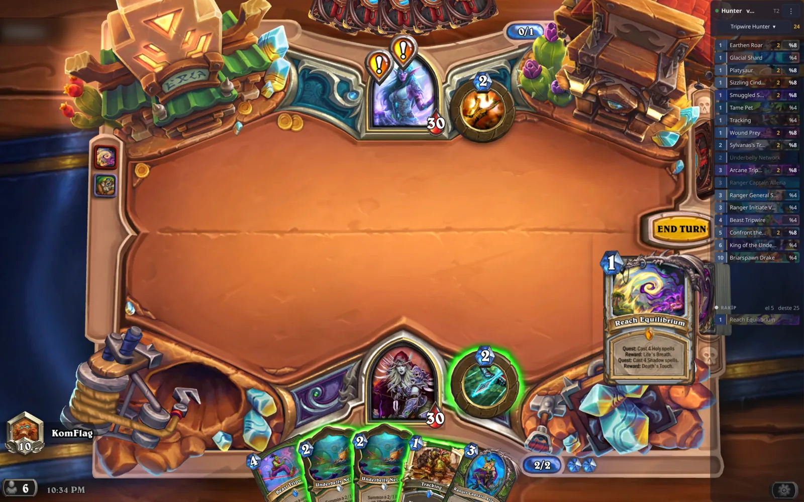

# deste

English | [Türkçe](README.tr.md)

A Hearthstone deck tracker for Linux (KDE Wayland). It reads the game's own log
files: no screen capture, no image recognition, no memory reading. When a new
set is released only the card data is updated, not the code.

It exists because the one open source tracker on Linux, Arena Tracker, is
unmaintained and its Qt5 + OpenCV design breaks on every patch. "Deste" is
Turkish for "deck".



## What it does today

- **Your deck:** remaining cards sorted by mana cost, with counts. A card you
  drew does not disappear from the list, it fades in place, so "I already played
  this" stays visible.
- **Draw chance:** the odds of each card coming up on the next draw.
- **Opponent:** every card they played or revealed, plus how many cards are in
  their hand and deck.
- **No deck codes needed:** decks are read from the game's own offline cache and
  the one matching the match is picked by class and by the cards you draw. You
  can also pick one by hand from the menu.
- **Match history and win rate:** every finished match is written to a small
  sqlite file (mode, deck, both classes, result, turn count) and the `⋮` menu
  shows the win rate by deck and by opponent class.
- **Card art** as the background of each row, and the full card image (rules
  text included) when you hover over it.
- **Adjustable transparency**, an overlay mode (frameless, always on top) and a
  normal window mode, a system tray icon and a desktop shortcut.
- **English and Turkish interface**, switchable from the menu. It follows your
  system language by default.

## How it works

Every session the game writes a few log files under
`Logs/Hearthstone_YYYY_MM_DD_HH_MM_SS/`. `Power.log` contains the whole match:
entities being created, zone transitions (deck, hand, play, graveyard), tag
changes, turn boundaries and the result.

The flow:

```
a line of Power.log
  -> core/parser_power.py   turns the line into an Event (one regex table)
  -> core/state.py          applies it to game state (entities, zones, deck)
  -> data/decks.py          matches a known deck using class and drawn cards
  -> ui/window.py           remaining list, draw chances, opponent panel
```

`core/logtail.py` follows the file by offset and switches over when the game
starts a new session directory. `core/watcher.py` drives all of this without
knowing about Qt, which is why the same engine runs from the terminal
(`tools/live.py`) or over recorded logs (`tools/replay.py`).

Card names, costs and rarities are downloaded once from HearthstoneJSON into
`~/.cache/deste/`. Card images go to the same place, lazily and in the
background. With no network the app keeps running off the cache. Finished
matches go into `~/.local/share/deste/history.db`.

## Install

Requires Python 3.11+ and PyQt6. Everything else is the standard library.

```
./install.sh                # shortcut, icon, KWin rules
./install.sh --no-kwin      # shortcut only, do not touch the window manager
./install.sh --no-hs-rule   # without the Hearthstone rule
./install.sh --uninstall    # undo all of it
```

`install.sh` installs the desktop shortcut and the icon, writes a KWin rule that
keeps `wmclass=deste` above other windows, and asks KWin to reload its
configuration. All of it is reversible with `--uninstall`.

If you use a tiling script (Krohnkite and friends), add the panel to that
script's floating list yourself. The installer does not edit other people's
settings.

The game needs two files in place before it writes usable logs. If they are
already set up, nothing is touched:

- `<prefix>/users/<user>/AppData/Local/Blizzard/Hearthstone/log.config` with
  `[Power] Verbose=1`, `[Zone]`, `[LoadingScreen]`, `[Arena]`
- `<game dir>/client.config` with `[Log] FileSizeLimit.Int=-1`

The app never edits them on its own, it warns if something is missing.

## Usage

```
./run.sh                  # the interface (the desktop shortcut calls this)
python main.py --full     # start by replaying the current session log

python -m tools.live      # live tracking in the terminal
python -m tools.replay <log_dir> --deck   # replay a recorded session
python -m tools.import_history            # backfill history from old session logs
python -m tests.test_replay <log_dir>     # consistency tests
python -m tests.test_history              # match history tests
```

Closing the window drops the app into the tray, clicking the tray icon brings it
back. Transparency, window mode, language and deck selection live in the `⋮`
menu.

## Wayland notes

**Staying above the game.** In KWin a fullscreen window is raised into the
active layer, which sits above the keep-above layer. No overlay can stay on top
of a fullscreen game, whatever rule you write. The fix is to stop the game from
going fullscreen: `install.sh` writes a rule with `fullscreen=false` and
`noborder=true` for Hearthstone, so the game still covers the screen as a
borderless window, looks identical, and the overlay can stay above it. Games
launched through umu/Proton use the window class `steam_app_default`, which is
shared with other games, so the rule matches on the title (`Hearthstone`) too.

**Position.** On Wayland an application cannot know where its own window is on
screen, and cannot move itself. Dragging the panel goes through
`startSystemMove()` and lets the window manager do it. Calling `move()` does not
move the window, it only corrupts Qt's idea of where the window is, and after
that menus and the card preview end up at the bottom of the screen. For the same
reason only the size is persisted, never the position. Menu and preview
positions are computed relative to the window itself rather than to the screen
edges, so the unknown offset cancels out.

**Window size.** The layout does not impose its minimum size on the window
(`SetNoConstraint`), the header text is elided and the turn label has a fixed
width. Otherwise the match result made the panel grow on its own and you had to
resize it after every game.

**Icon.** The tray icon is deliberately not built with `QIcon.fromTheme`. Doing
that makes Qt send the icon's *name* instead of the icon itself, and Plasma
draws an empty square when a freshly installed icon is not in its cache yet.
`ui/icon.py` always builds the icon from files and ready-made PNGs.

## Architecture

```
core/     pure stdlib, knows nothing about UI or network, testable headless
  logdir.py       find the installation and the log directory, check log.config
  logtail.py      offset based file following
  parser_power.py a line of Power.log -> event
  state.py        event -> game state (entities, zones, deck)
  watcher.py      live tracking loop (no Qt dependency)
  deckstring.py   deck code encode/decode
  history.py      match history and win rate (sqlite)
  config.py       user settings
data/     network and disk cache
  cards.py        HearthstoneJSON card data
  localdecks.py   decks from the game's offline cache
  decks.py        deck library and match-to-deck matching
  images.py       card images (tile and full render), downloaded in background
ui/       PyQt6 interface
  window.py       panel, tray icon, transparency, window modes
  history_window.py  match history, win rate by deck and by class
  widgets.py      card row (art strip) and hover preview
  i18n.py         interface strings, English and Turkish
  theme.py        colors and style
  icon.py         application icon
tools/    replay and terminal live tracking
tests/    consistency tests over a real log corpus
```

### Design decisions

**Power.log is the single source of truth.** Zone.log is easier to read, but
merging two files by timestamp is complexity for nothing. Power.log already has
the match boundaries, the metadata and every zone transition. Zone.log is used
only in the tests, as an independent source to check against.

**Only `GameState.*` lines are processed.** `PowerTaskList.*` lines are the
client side copy of the same content; process both and every event is counted
twice.

**State is tracked, not events.** Log lines can repeat, so "decrement the counter
on every DECK -> HAND line" gives wrong results. Each entity's zone is stored and
only real transitions are processed.

**Deck tracking is independent from deck selection.** The tracker only records
what left your deck and what got shuffled in. The remaining list is computed
against a deck list when asked, so you can still pick the deck mid-match.

**Generated cards do not come out of your deck.** Discovered, copied or randomly
generated cards never touch the deck counter. Cards shuffled into your deck
during the game are added to the list instead.

**Log files are never deleted.** They are only read.

**A match lands in the history the moment its result is known**, not when the
game object is closed (that only happens once the next match starts). The
session directory plus the match start time is the unique key, so importing old
logs into the same database can be repeated without producing duplicates.

## Verification

`tests/test_replay.py` uses no synthetic data, it reads real session logs from
the machine. The two checks that matter most:

1. **Cross-check against an independent source:** the set of "cards I drew"
   derived from Power.log must match the `FRIENDLY DECK -> FRIENDLY HAND`
   transitions in Zone.log, entity id by entity id.
2. **The remaining list must agree with the game's own counter:** the size of the
   computed remaining deck must equal the number of cards in the game's DECK
   zone. Miss a draw, or fail to count a shuffled-in card, and this breaks
   immediately.

Run over 6 sessions and 33 matches, all passing.

Window manager behaviour (menu and preview placement, staying out of tiling) is
exercised in a virtual KWin session: `kwin_wayland --virtual --width 1800
--height 1125`. That way the test never opens a window on your screen.

## Roadmap

Next:

- **Opponent archetype prediction:** match revealed cards against HSReplay
  signature cards and show something like "Zee Shaman, 4/8 signature cards". If
  the match is weak the panel hides itself instead of inventing a guess.
- **Opponent secret tracking:** candidates for a played secret get eliminated by
  game events. The elimination rules live in `rules/secrets.json` as data, so a
  new set means updating that file, not the code.

Later:

- Arena draft assistant. The only feature that needs screen capture: recognise
  cards by a perceptual hash (pHash) of the art, score them from published arena
  statistics.
- Battlegrounds panel
- Mulligan statistics, per-deck analysis
- Turn/rope timer, Twitch overlay, HSReplay upload

## Notes

Card data comes from HearthstoneJSON, card art belongs to Blizzard. This project
is not affiliated with Blizzard. The app only reads the log files the game
itself writes; it does not touch the game's memory or network traffic.
